# Process Flow Diagrams
## Recruitment Process Automation — emergiTEL Inc.

---

**Document Version:** 1.0  
**Prepared By:** Ankit Prakash Srivastava — Lead Business Analyst  
**Reviewed By:** Sonika Salhotra — Recruitment SME  
**Date:** 2025

> Note: All diagrams below are rendered in Mermaid-compatible syntax. GitHub renders Mermaid natively. Use a Mermaid viewer or the GitHub preview to see rendered diagrams.

---

## Table of Contents

1. [Process Index](#1-process-index)
2. [AS-IS: Overall Recruitment Workflow](#2-as-is-overall-recruitment-workflow)
3. [TO-BE: Overall Recruitment Workflow](#3-to-be-overall-recruitment-workflow)
4. [Process 01 — Job Requisition & Multi-Board Posting](#4-process-01--job-requisition--multi-board-posting)
5. [Process 02 — Candidate Submission & Pipeline Management](#5-process-02--candidate-submission--pipeline-management)
6. [Process 03 — Interview Scheduling (Outlook Integration)](#6-process-03--interview-scheduling-outlook-integration)
7. [Process 04 — Offer Management](#7-process-04--offer-management)
8. [Process 05 — Placement & Finance Workflow](#8-process-05--placement--finance-workflow)
9. [Process 06 — Timesheet Approval & Payroll Automation](#9-process-06--timesheet-approval--payroll-automation)
10. [Swimlane: End-to-End Recruitment Lifecycle](#10-swimlane-end-to-end-recruitment-lifecycle)
11. [Process Change Summary](#11-process-change-summary)

---

## 1. Process Index

| Process ID | Process Name | AS-IS Documented | TO-BE Documented |
|---|---|---|---|
| PROC-01 | Job Requisition & Multi-Board Posting | Yes | Yes |
| PROC-02 | Candidate Submission & Pipeline Management | Yes | Yes |
| PROC-03 | Interview Scheduling | Yes | Yes |
| PROC-04 | Offer Management | Yes | Yes |
| PROC-05 | Placement & Finance Workflow | Yes | Yes |
| PROC-06 | Timesheet Approval & Payroll Automation | Yes | Yes |

---

## 2. AS-IS: Overall Recruitment Workflow

The following diagram captures the high-level AS-IS process — how recruitment operations functioned before this system was built.

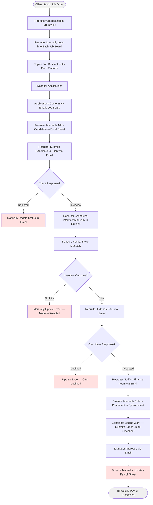

**AS-IS Pain Points Highlighted:**
- Manual job posting to each board independently
- No candidate record in a shared system — Excel only
- No link between Outlook calendar events and candidate records
- Finance notification dependent on email communication
- Payroll triggered manually from spreadsheet update

---

## 3. TO-BE: Overall Recruitment Workflow

The following diagram captures the target state with the new system in place.

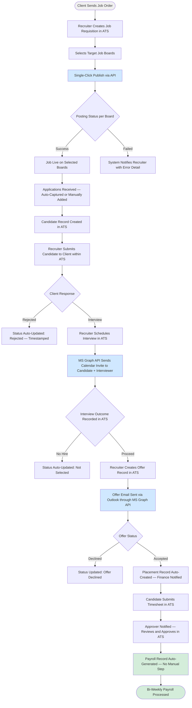

---

## 4. Process 01 — Job Requisition & Multi-Board Posting

### AS-IS

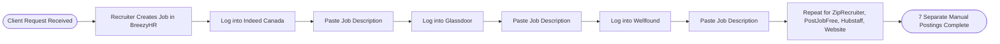

**Estimated Time:** 45–60 minutes per job posting  
**Risk:** Inconsistent job descriptions across boards, human error

### TO-BE

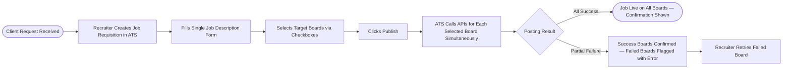

**Estimated Time:** 3–5 minutes per job posting  
**Improvement:** 90% reduction in manual effort for job distribution

---

## 5. Process 02 — Candidate Submission & Pipeline Management

### AS-IS

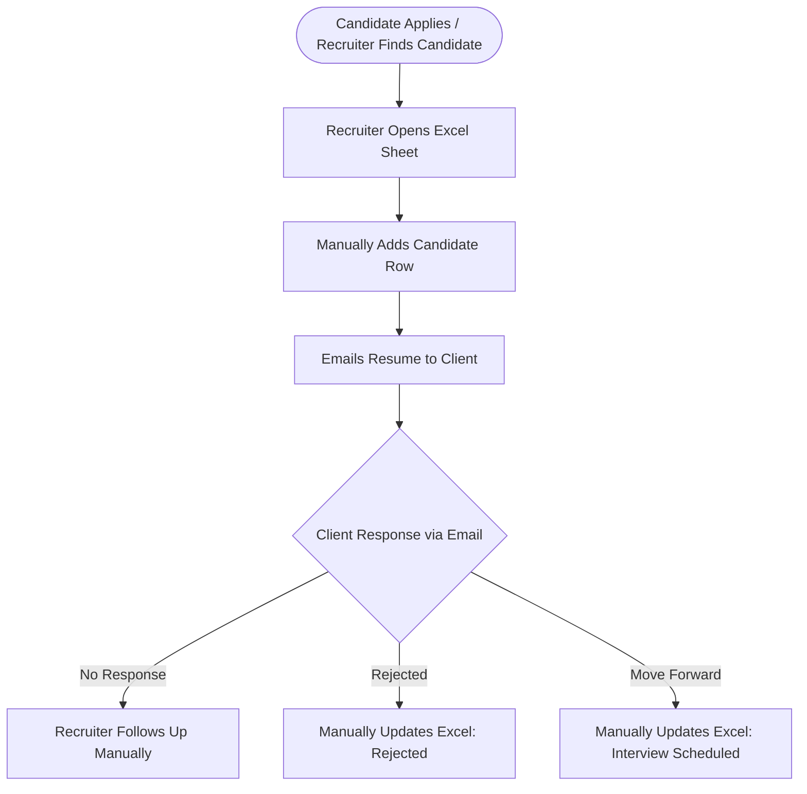

### TO-BE

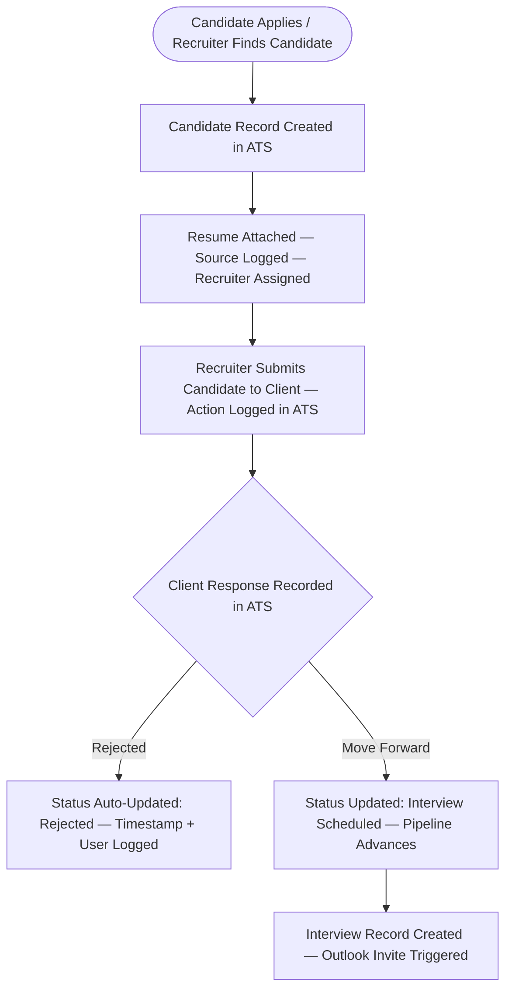

---

## 6. Process 03 — Interview Scheduling (Outlook Integration)

### AS-IS

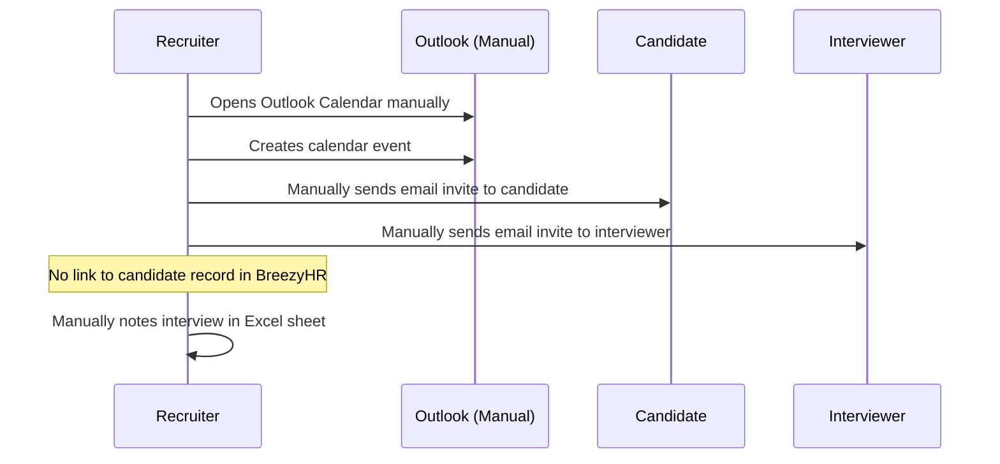

### TO-BE

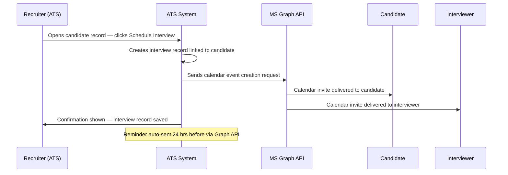

---

## 7. Process 04 — Offer Management

### AS-IS

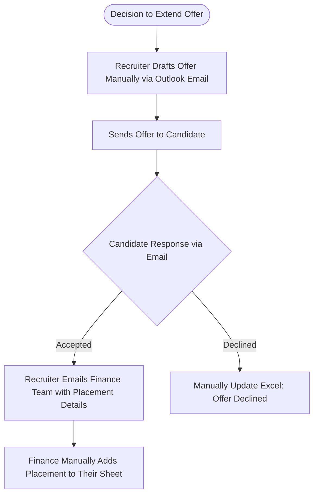

### TO-BE

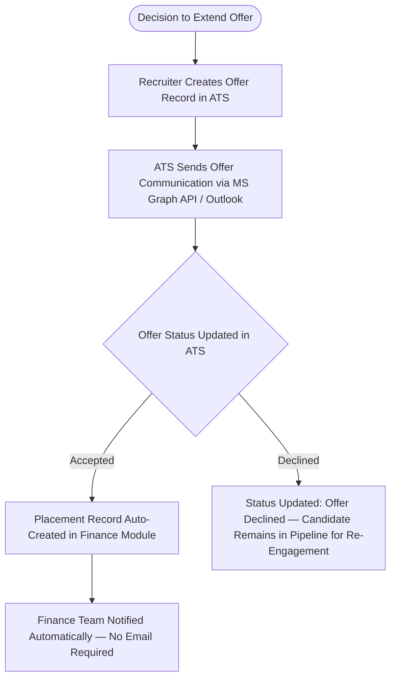

---

## 8. Process 05 — Placement & Finance Workflow

### AS-IS

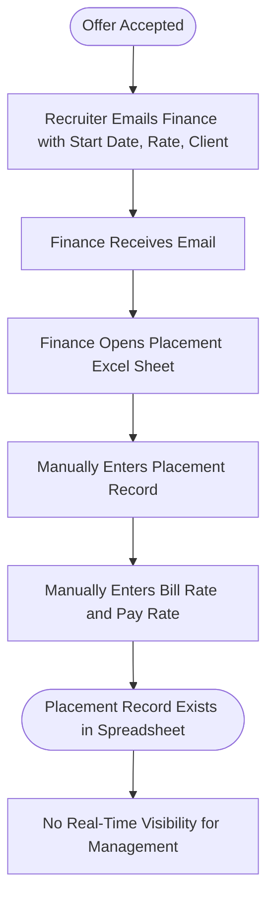

### TO-BE

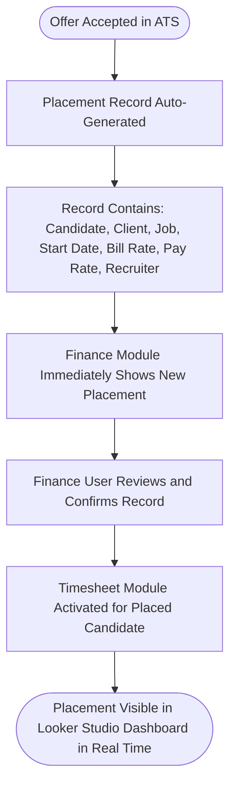

---

## 9. Process 06 — Timesheet Approval & Payroll Automation

### AS-IS

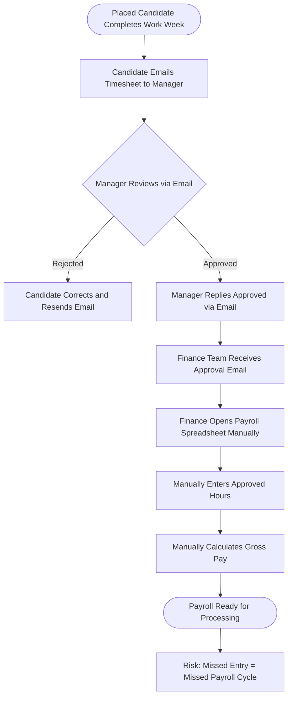

### TO-BE

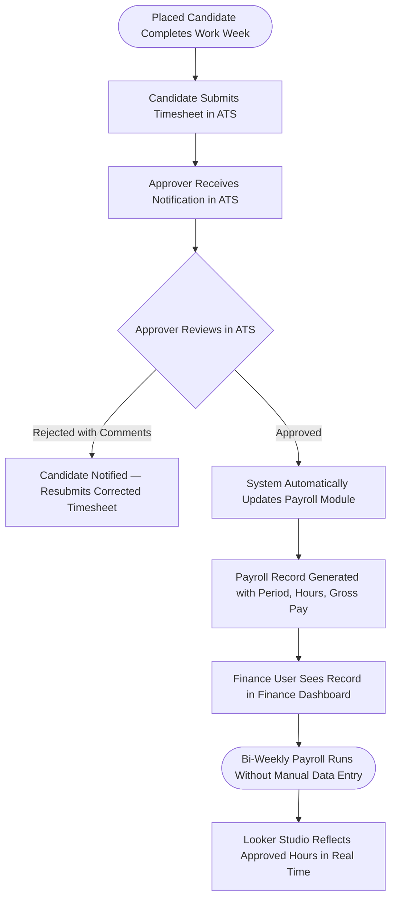

**Key Automation Win:** Approval of a timesheet in the ATS is the single trigger that initiates the payroll record — zero manual steps required.

---

## 10. Swimlane: End-to-End Recruitment Lifecycle

The following swimlane maps the complete TO-BE process across all actors.

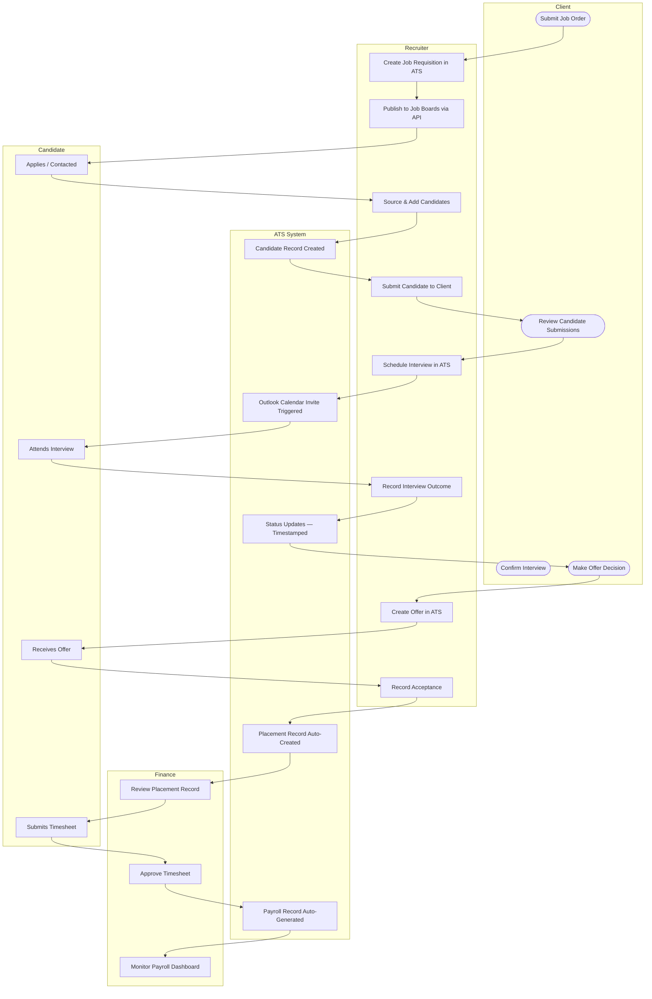

---

## 11. Process Change Summary

| Process | AS-IS Steps | TO-BE Steps | Manual Steps Eliminated | Key Automation |
|---|---|---|---|---|
| Job Posting | 14+ (log in per board, paste per board) | 4 (create, select, publish, confirm) | 10+ | API-based multi-board distribution |
| Candidate Tracking | 5+ (open Excel, add row, update per event) | 2 (record created, status updated in ATS) | 3+ | ATS pipeline with auto-timestamping |
| Interview Scheduling | 6 (open Outlook, create event, email candidate, email interviewer, note in Excel) | 2 (click schedule, confirm) | 4 | MS Graph API calendar and email |
| Offer Management | 5 (draft email, send, receive response, email finance, update sheet) | 3 (create offer, send via ATS, record response) | 2 | Auto-placement creation on acceptance |
| Placement Record | 4 (receive email, open sheet, enter record, notify) | 0 (fully automated) | 4 | Placement auto-created from offer acceptance |
| Payroll Processing | 5 (receive approval email, open sheet, enter hours, calculate, save) | 0 (fully automated) | 5 | Payroll record auto-generated on timesheet approval |

---

*All process diagrams reflect requirements documented in the BRD and validated with Sonika Salhotra (Recruitment SME) during stakeholder review sessions.*
